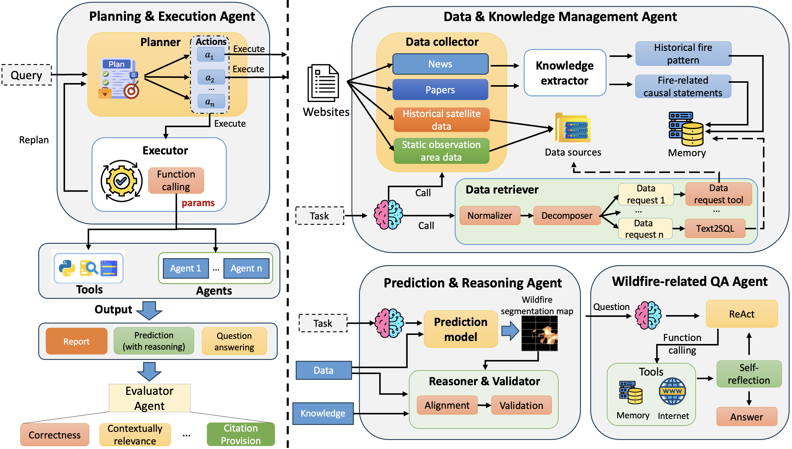
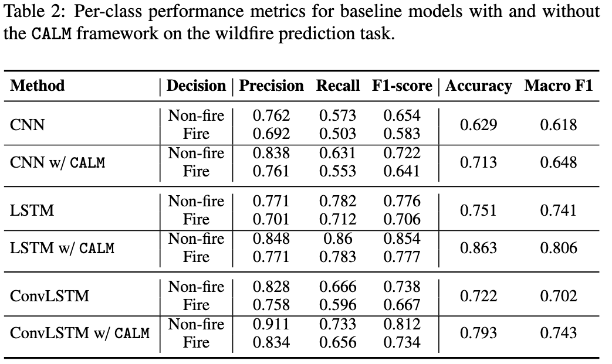
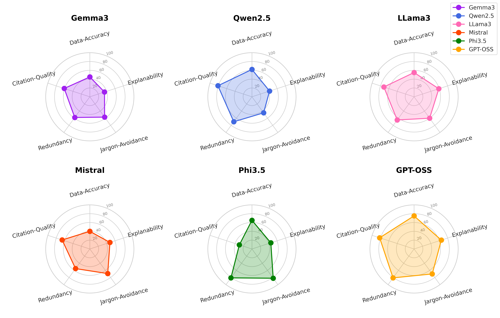
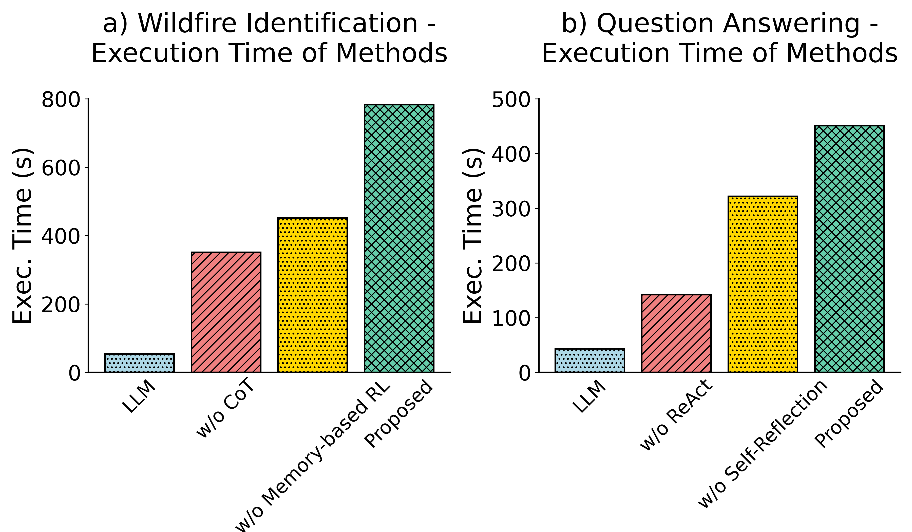
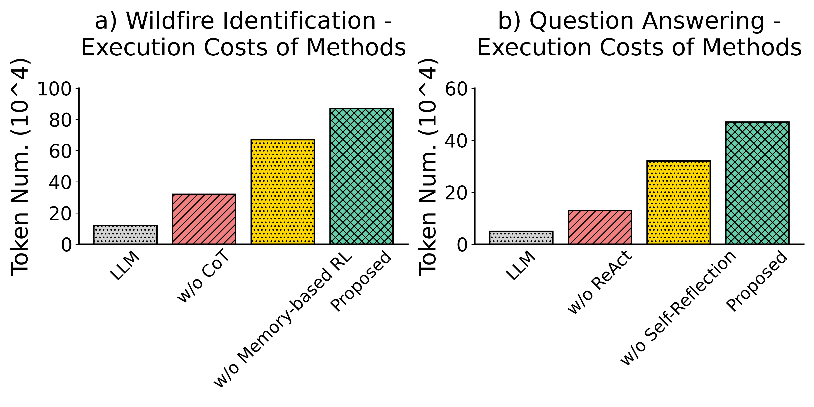

# Code-free and Adaptive wiLdfire Monitoring (CALM)

This repository contains the source code and resources for the **Code-free and Adaptive wiLdfire Monitoring (CALM)** framework, a multi-agent system designed for autonomous, real-time wildfire monitoring and analysis. CALM integrates advanced AI techniques to provide dynamic, interpretable, and actionable intelligence for wildfire management. The system leverages a decentralized team of specialized agents for planning, data management, prediction, and reasoning, overcoming the limitations of static, black-box prediction models. 

The full code of project will be published after paper being accepted.

<p align="center">
  
  <br>
  <em>Figure 1: High-level architecture of the CALM framework, showcasing the four specialized agents and their interactions.</em>
</p>

---

## Project Overview

Wildfires present a significant and growing challenge, demanding sophisticated tools for real-time monitoring and proactive decision-making. Traditional machine learning models often provide accurate but opaque predictions, lacking the dynamic, context-aware reasoning needed by fire management teams. CALM addresses this gap by introducing a novel agentic AI framework that automates complex workflows, from data ingestion to delivering reasoned, evidence-backed explanations.

### Core Features

- **Multi-Agent System**: A team of four specialized agents collaborates to handle distinct tasks: planning, data management, prediction, and question answering.
- **Dynamic Planning & Execution**: The Planning & Execution Agent decomposes high-level user queries into executable steps, coordinates other agents, and adapts plans based on real-time feedback.
- **Multimodal Data Integration**: The Data & Knowledge Management Agent autonomously gathers and fuses data from diverse sources, including satellite imagery, weather reports, news articles, and scientific papers.
- **Interpretable Predictions**: The Prediction & Reasoning Agent not only predicts wildfire spread but also validates its own findings and provides transparent, natural-language explanations for its reasoning, leveraging Chain-of-Thought (CoT) processes.
- **Adaptive Learning**: The system incorporates a memory-based reinforcement learning component, allowing it to learn from past interactions and improve its performance over time.

---

## System Architecture

The CALM framework is built upon a decentralized multi-agent architecture, where each agent possesses specialized skills and responsibilities. This design enables a robust and scalable solution for handling the complexities of wildfire monitoring.

1.  **Planning & Execution Agent**: Serves as the cognitive core of the system. It receives user queries, develops a strategic plan, orchestrates the other agents, and refines the plan based on execution outcomes.

2.  **Data & Knowledge Management Agent**: Acts as the central hub for information processing. It autonomously collects data from web sources, extracts relevant knowledge, and retrieves information from its memory to fulfill requests from other agents.

3.  **Prediction & Reasoning Agent**: Performs the core analytical tasks. It runs predictive models to generate wildfire segmentation maps and uses a Reasoner & Validator module to align predictions with contextual knowledge, ensuring the final output is both accurate and logically sound.

4.  **Wildfire-related QA Agent**: Handles interactive, conversational queries. It uses a ReAct-style framework to search for information, access its internal memory, and provide self-reflecting, context-aware answers with proper citations.

---

## Getting Started

This section provides instructions for setting up the environment and running the CALM framework.

### Prerequisites

- Python 3.12 or later
- PyTorch 2.0 or later
- Access to Google Earth Engine for static observation-area data

### Installation

First, clone the repository to your local machine:
```bash
git clone https://github.com/your-username/calm-wildfire.git
cd calm-wildfire
```

Next, install the required Python libraries using the provided requirements file:
```bash
pip install -r requirements.txt
```

---

## Experimental Results

We evaluated the CALM framework on two primary tasks: **Wildfire Identification** and **Wildfire-related Question Answering (QA)**. The experiments demonstrate significant improvements over traditional baselines in both accuracy and efficiency.

### Wildfire Prediction Performance

CALM was tested against several baseline deep learning models (CNN, LSTM, ConvLSTM) for wildfire prediction. The framework consistently improves the performance of each model by integrating contextual reasoning and validation. The table below summarizes the per-class metrics, showing substantial gains in F1-score and accuracy.

<p align="center">
  
  <br>
  <em>Table 1: Per-class performance metrics for baseline models with and without the CALM framework.</em>
</p>

The qualitative results are also compelling. The heatmap below shows how CALM's validation process refines the initial probabilistic outputs of a ConvLSTM model, resulting in a more accurate and confident prediction of the burned area.

<p align="center">
  
  <br>
  <em>Figure 2: Comparison of wildfire prediction heatmaps before and after applying CALM's validation module.</em>
</p>

### Question Answering Performance

The QA Agent's performance was evaluated using a benchmark of 132 questions. We assessed various open-source Large Language Models (LLMs) on five criteria: Data-Accuracy, Explainability, Jargon-Avoidance, Redundancy, and Citation-Quality. The GPT-OSS model demonstrated the strongest overall performance, particularly in providing citable and accurate answers.

<p align="center">
  
  <br>
  <em>Figure 3: Radar charts comparing six LLMs across five key evaluation criteria for the QA task.</em>
</p>

### Efficiency and Cost Analysis

While agentic systems provide more comprehensive results, they often come with higher computational costs. Our analysis shows that while the full proposed model is the most resource-intensive, its modular design allows for targeted optimizations. For instance, the memory-based reinforcement learning and self-reflection components, while crucial for accuracy, are the primary drivers of execution time and token consumption. This highlights a trade-off between performance and cost.

<p align="center">
  
  <br>
  <em>Figure 4: Execution time comparison across different model configurations for both tasks.</em>
</p>

<p align="center">
  
  <br>
  <em>Figure 5: Token consumption (cost) comparison across different model configurations.</em>
</p>

---

## Acknowledgments

This work leverages several open-source projects and datasets. We thank the creators of the FireCube dataset and the developers of the various LLMs used in our evaluation.
